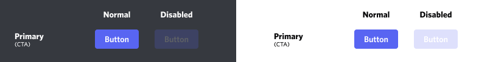

# 📑 Preface

I found a good solution to all the issues, expect for the fact that I moved out of my previous home into a new one so I'm gonna have some issues commiting all changes for a few days. Obviously, when you read this, I already have internet but I just wanted to remind you guys, that I have things to do in everyday life.

# ❗ Issues

We have some issues about the button interaction, specifically the blue "Primary call-to-action" buttons.



The `discord_components` module currently does not support it's way of sending private messages to the user using the command.

As of now, this is not in our hands and we cannot fix this.
The commented line needs the interaction message.

```py
button = await ctx.send(
		embed = embed,
		components = [
		#	Button(style = 1, label = 'Info', disabled = True),
			Button(style = 5, label = 'Click to invite me!', url = f'{INVITE_URL}')
			]
		)
```
